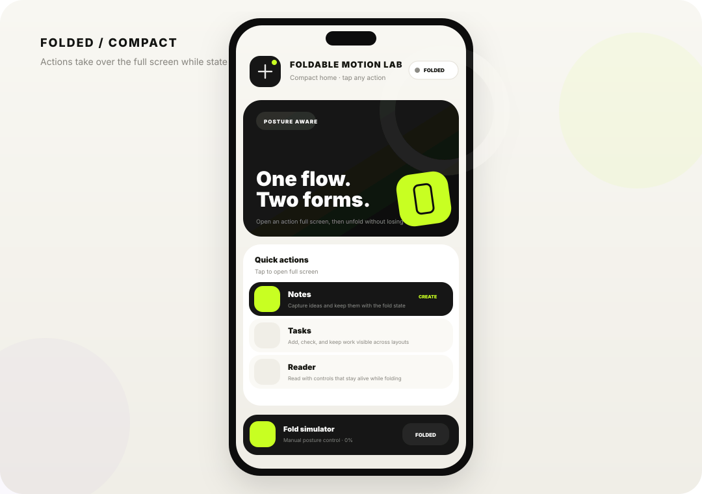
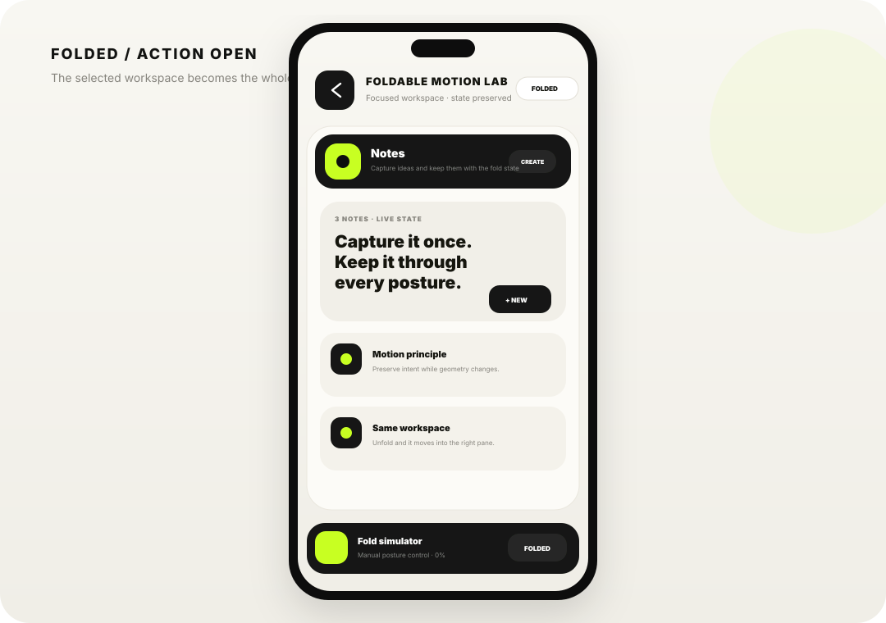
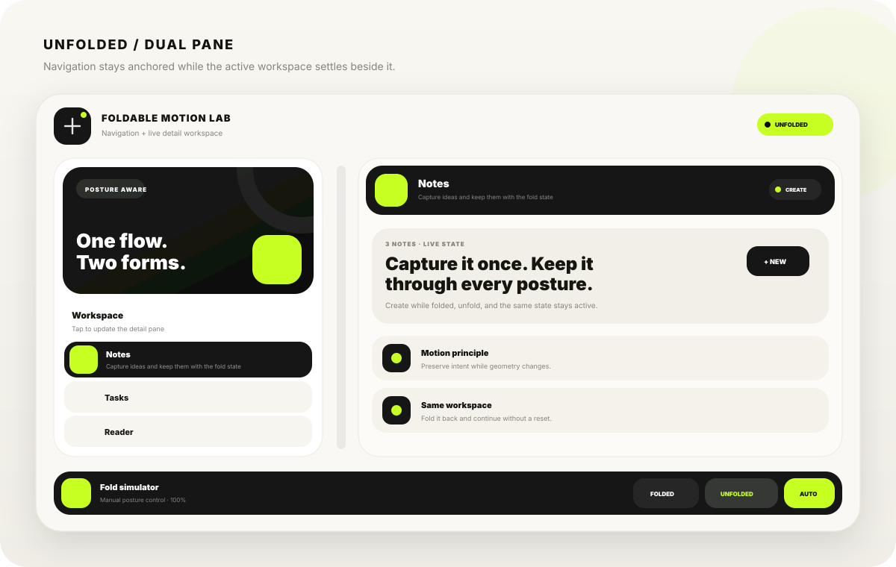

<div align="center">

# Foldable Motion Lab

**A Flutter playground for interfaces that stay coherent while a phone folds and unfolds.**

One state tree. One selected action. Multiple postures.

</div>

<p align="center">
  
  
</p>

<p align="center">
  
</p>

## Why this exists

Most responsive demos only resize widgets. Foldable Motion Lab is focused on something more important: **preserving user intent while the physical shape of the device changes**.

The selected action is not recreated when the phone changes posture. Notes, tasks, reader controls, and settings remain alive while the presentation morphs between compact and dual-pane layouts.

## Posture behavior

| Situation | Folded | Unfolded |
| --- | --- | --- |
| Home | Action list fills the screen | Action list becomes the left navigation pane |
| Tap an action | Opens as a full-screen workspace | Updates the right detail pane |
| Fold with an action open | Keeps that action full screen | — |
| Unfold with an action open | — | Moves the same live action into the right pane |
| State | Preserved | Preserved |

### The key interaction

```text
FOLDED HOME                      UNFOLDED
┌──────────────────┐            ┌────────────┬────────────────┐
│                  │            │            │                │
│   action list    │ ─────────▶ │ navigation │ live detail    │
│                  │            │            │                │
└──────────────────┘            └────────────┴────────────────┘

FOLDED DETAIL                    UNFOLDED
┌──────────────────┐            ┌────────────┬────────────────┐
│                  │            │            │                │
│ selected action  │ ─────────▶ │ navigation │ SAME action    │
│                  │            │            │ SAME state     │
└──────────────────┘            └────────────┴────────────────┘
```

## Functional workspaces

The demo is intentionally interactive instead of being a static animation.

- **Notes** — create and delete notes while testing posture transitions.
- **Tasks** — add, complete, uncomplete, and delete tasks.
- **Reader** — change reading scale and bookmark state.
- **Fold settings** — toggle the fold guide and dense navigation mode.

All of these values live outside the visual posture, so folding only changes **presentation**, not **app state**.

## Motion model

The interface is driven by two continuous values:

```dart
foldProgress   // 0.0 folded  -> 1.0 unfolded
detailProgress // 0.0 home    -> 1.0 compact detail open
```

The fold motion uses a `700ms` `fastOutSlowIn` transition. The compact detail uses perspective `rotateY`, width interpolation, opacity, and position interpolation so the workspace feels like it physically moves into the unfolded pane instead of being replaced.

## Real foldable support

The app reads `MediaQuery.displayFeatures` and only treats these as real posture features:

```dart
DisplayFeatureType.fold
DisplayFeatureType.hinge
```

Camera holes and display cutouts are ignored. When Flutter exposes a physical hinge width, that width becomes part of the dual-pane gap.

## Fold simulator

The bottom dock lets you test the experience on a normal phone, desktop window, emulator, or physical foldable.

- drag the slider for frame-by-frame inspection
- tap **Folded**
- tap **Unfolded**
- enable **Auto** to follow the actual device/window posture

This makes motion tuning possible without constantly changing hardware posture.

## Visual direction

The current UI uses a restrained editorial system built around:

- warm paper-like surfaces
- deep charcoal workspace cards
- a bright lime posture accent
- rounded, high-contrast action surfaces
- subtle ambient color behind the app shell
- one visual language across folded and unfolded modes

The goal is for the app to feel like one product changing shape, not two unrelated layouts.

## Project structure

```text
lib/
├── main.dart
├── fold/
│   ├── fold_device_info.dart
│   └── fold_motion_controller.dart
├── models/
│   └── lab_action.dart
├── state/
│   └── fold_lab_store.dart
├── screens/
│   └── functional_fold_screen.dart
└── widgets/
    ├── fold_detail_panel.dart
    ├── fold_home_panel.dart
    └── fold_simulator_bar.dart

docs/
└── screenshots/
    ├── folded-home.svg
    ├── folded-action.svg
    └── unfolded-workspace.svg
```

## Run

```bash
flutter pub get
flutter run
```

For the best test, run it on an Android foldable emulator or a resizable desktop window and leave **Auto** enabled.

## Quality checks

GitHub Actions runs:

```bash
flutter analyze
flutter test
```

The existing widget tests verify the action flow, while the fold controller keeps posture animation independent from app state.

---

<div align="center">

Built to explore **posture-aware Flutter UI**, not just responsive breakpoints.

</div>
